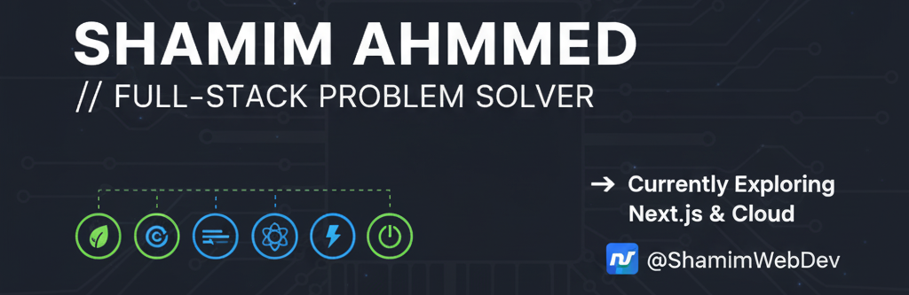

# 👋 Hi, I'm **Shamim Ahmmed**
A passionate **MERN Stack Developer** and **Full-Stack Problem Solver**. I love building creative digital products, teaching what I learn, and helping others grow in the tech world.

Outside of coding, I enjoy **writing articles**, exploring new technologies, and working on impactful projects.

---

## ❤️ About Me
- 🚀 MERN Stack Developer (MongoDB, Express, React, Node.js)
- 🎯 Focused on Full Stack Web Development
- 📚 I love sharing knowledge and breaking down complex topics
- ✍️ Passionate about writing and teaching
- 🌱 Currently improving skills in **Next.js**, **Cloud**, and **System Design**

---

## 🛠️ When I Code, I Rely On

| **Skills Overview** | **Technologies** |
|----------------------|-----------------------------------------------------------------------------------------------------------------------------------------------------------------------------------------------------------------------------------------------------------------------------------------------------------------------------------|
| **Languages** |   |
| **Frontend Technologies** |       |
| **Back-End Development** |    |
| **Database** |   |
| **Tools & Platforms** |      |

---

## 📊 GitHub Stats

| **Top Languages** | **GitHub Stats** | **GitHub Streak** |
|:---:|:---:|:---:|
|  |  |  |

---

## 📬 Contact
Feel free to reach out or connect with me:

- **Email**: shamim.ct17@gmail.com.com  
- **LinkedIn**: [Click Here](https://www.linkedin.com/in/ShamimWebDev/)  
- **Facebook**: [Click Here](https://www.facebook.com/ShamimWebDev1)

Let's connect and collaborate on exciting opportunities!
